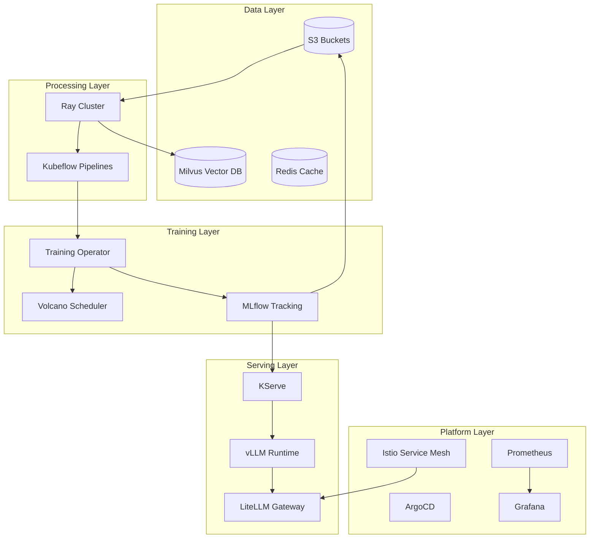
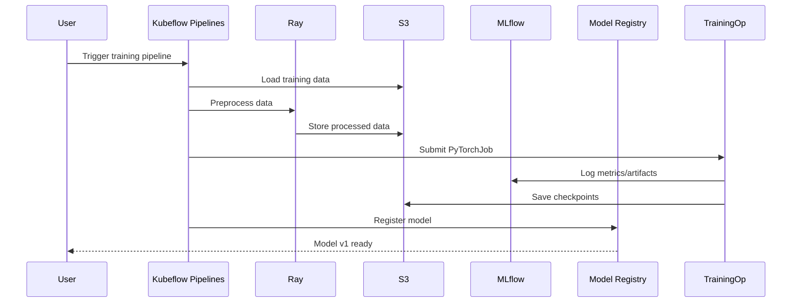
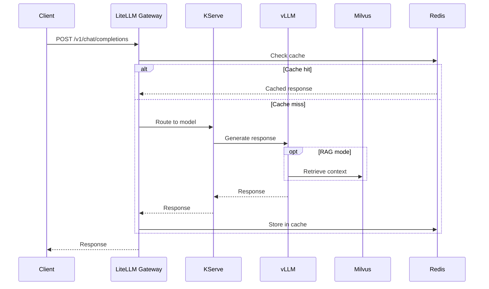

# LLM MLOps Platform - Architecture Overview

> **Version:** 1.0.0  
> **Last Updated:** 2026-01-29

## Executive Summary

The LLM MLOps Platform is a production-grade infrastructure for fine-tuning, serving, and evaluating Large Language Models (LLMs) at scale. Built on Kubernetes with GitOps principles, it provides end-to-end capabilities from data ingestion through model deployment with comprehensive observability.

## System Architecture



## Component Overview

### Data Infrastructure

| Component | Purpose | Technology |
|-----------|---------|------------|
| Object Storage | Raw data, models, artifacts | S3-compatible |
| Vector Database | Embedding storage and retrieval | Milvus |
| Caching | Request/response caching | Redis |
| Data Processing | Distributed data processing | Ray |

### Training Infrastructure

| Component | Purpose | Technology |
|-----------|---------|------------|
| Pipeline Orchestration | ML workflow automation | Kubeflow Pipelines |
| Distributed Training | Multi-GPU training jobs | Training Operator + PyTorchJob |
| Gang Scheduling | Coordinated GPU allocation | Volcano |
| Experiment Tracking | Metrics, params, artifacts | MLflow |
| Model Registry | Model versioning and staging | MLflow Model Registry |

### Serving Infrastructure

| Component | Purpose | Technology |
|-----------|---------|------------|
| Model Serving | Serverless model deployment | KServe |
| LLM Inference | High-throughput LLM serving | vLLM |
| API Gateway | Unified API, routing, fallback | LiteLLM |
| Traffic Management | Canary, A/B testing | Istio |

### Platform Services

| Component | Purpose | Technology |
|-----------|---------|------------|
| GitOps | Infrastructure as Code sync | ArgoCD |
| Service Mesh | mTLS, observability, routing | Istio |
| Metrics | Time-series metrics | Prometheus |
| Visualization | Dashboards and alerting | Grafana |
| Logging | Centralized log aggregation | Loki |
| Secrets | External secrets sync | External Secrets Operator |

## Data Flow

### Training Pipeline



### Inference Pipeline



## Deployment Architecture

### Kubernetes Namespaces

```
├── argocd              # ArgoCD components
├── istio-system        # Istio control plane
├── monitoring          # Prometheus, Grafana, Loki
├── cert-manager        # TLS certificate management
├── mlops-system        # Core MLOps components (KFP, MLflow)
├── mlops-data          # Data infrastructure (Ray, Milvus)
├── mlops-training      # Training workloads
└── mlops-serving       # Model serving (KServe, vLLM, LiteLLM)
```

### Node Groups

| Node Group | Instance Type | Purpose | Scaling |
|------------|---------------|---------|---------|
| System | m6i.xlarge | Platform services | 2-6 nodes |
| CPU Workers | m6i.2xlarge | Data processing, pipelines | 2-10 nodes |
| GPU Training | g5.xlarge | Model training | 0-8 nodes |
| GPU Inference | g5.xlarge | Model serving | 1-4 nodes |

## Security Architecture

### Network Security

- **VPC Isolation**: Private subnets for workloads
- **Network Policies**: Namespace-level isolation
- **Service Mesh**: mTLS for all internal traffic
- **Ingress**: Istio Gateway with TLS termination

### Identity & Access

- **IRSA**: IAM Roles for Service Accounts
- **RBAC**: Kubernetes role-based access control
- **API Keys**: LiteLLM API key management
- **Secrets**: External Secrets Operator for AWS Secrets Manager

### Data Security

- **Encryption at Rest**: S3, EBS, RDS encryption
- **Encryption in Transit**: TLS everywhere
- **Model Access**: Signed URLs for model artifacts

## Observability

### Metrics

Key metrics collected across the platform:

- **Infrastructure**: CPU, memory, GPU utilization
- **Training**: Loss, learning rate, throughput
- **Serving**: Latency (P50, P95, P99), throughput, error rates
- **Pipeline**: Duration, success rate, queue time

### Logging

Structured logging with:
- Request tracing (Istio)
- Application logs (Loki)
- Audit logs (Kubernetes)

### Alerting

Critical alerts for:
- Model serving errors > 1%
- P99 latency > 2s
- GPU memory > 90%
- Training job failures
- Pipeline failures

## Disaster Recovery

### Backup Strategy

| Component | Backup Method | Frequency | Retention |
|-----------|---------------|-----------|-----------|
| S3 Data | Cross-region replication | Real-time | Indefinite |
| MLflow DB | RDS automated backups | Daily | 7 days |
| Milvus | S3 snapshots | Daily | 30 days |
| Kubernetes | Velero backups | Daily | 14 days |

### Recovery Procedures

1. **Model Registry**: Restore from RDS backup
2. **Vector Store**: Restore from S3 snapshot
3. **Cluster State**: Restore from Velero backup
4. **GitOps**: ArgoCD auto-sync from Git

## Capacity Planning

### Resource Estimates

| Workload | vCPU | Memory | GPU | Storage |
|----------|------|--------|-----|---------|
| Platform Services | 16 | 32GB | - | 100GB |
| Data Processing | 32 | 128GB | - | 500GB |
| Training (7B model) | 8 | 32GB | 1 x A10G | 100GB |
| Serving (7B model) | 4 | 24GB | 1 x A10G | 50GB |

### Cost Optimization

- **Spot Instances**: Training workloads on spot
- **Autoscaling**: Scale-to-zero for inference
- **Resource Quotas**: Namespace-level limits
- **Rightsizing**: Regular resource audits

## Technology Stack

### Cloud Provider
- AWS (EKS, S3, RDS, ElastiCache)

### Container Orchestration
- Kubernetes 1.29+
- Helm 3.14+
- Kustomize

### ML Frameworks
- PyTorch + Transformers
- PEFT (LoRA/QLoRA)
- DeepSpeed ZeRO-3

### Evaluation
- RAGAS
- DeepEval

### Languages
- Python 3.10+
- YAML/JSON (configuration)
- HCL (Terraform)
